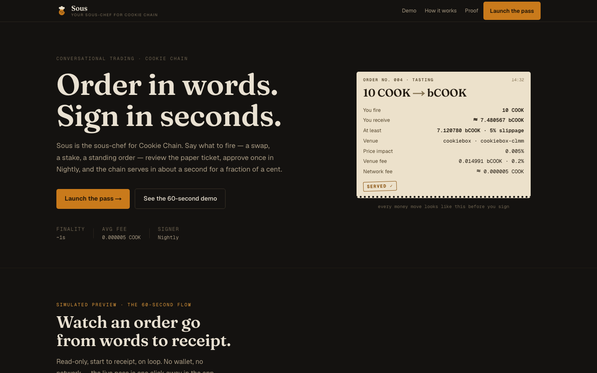
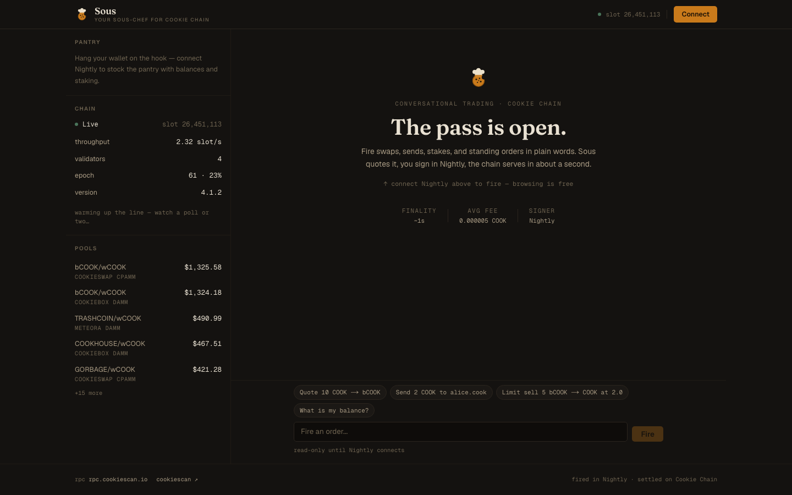

# Sous — your sous-chef for Cookie Chain

Sous preps, tastes, and plates your Cookie Chain moves: quotes, swaps,
stake, limit orders, bridge. You review the ticket, sign in Nightly, get
a Cookiescan receipt. Yes, Chef!

Built for Cookie Chain traders and stakers — COOK / bCOOK holders, LP and
limit-order users, bridge users, `.cook` name holders. Every money move is
a real on-chain transaction signed by your own wallet; the app never holds
keys.



<p align="center"><em>Every money move prints a paper ticket — estimate, guaranteed floor, venue, both fees — before the wallet ever opens.</em></p>



<p align="center"><em>The pass: live slot, epoch and pool board render before you connect. Browsing is free; only firing needs a wallet.</em></p>

## Quickstart

Standard: `pnpm` only (see note below).

```bash
cp .env.example .env
pnpm install
# terminal 1: MCP sidecar in external-signer mode (no keys in the app process)
COOKIE_SIGNER=external npx -y cookie-mcp --http 8787
# terminal 2: web app
pnpm dev
```

Open http://localhost:3000 → **Launch the pass** → `/app` → connect
**Nightly** → try `Quote 10 COOK -> bCOOK`.

Health checks: `pnpm chain:health` (RPC slot) and `GET /api/health`.

> pnpm-only: mixing npm + pnpm breaks installs. This repo standardizes on
> pnpm (`packageManager: pnpm@11.24.0`). Do not reintroduce
> `package-lock.json`. If `pnpm install` complains about ignored build
> scripts, `pnpm-workspace.yaml > allowBuilds` already pins the answer.

## Scripts

| cmd | what |
|---|---|
| `pnpm dev` | Next.js dev |
| `pnpm build` | production build |
| `pnpm lint` | eslint |
| `pnpm typecheck` | tsc --noEmit |
| `pnpm test` | vitest unit suite (intent, shapes, guard, fire path, tx, slot) |
| `pnpm chain:health` | RPC slot check |

## How it works

See `docs/ARCHITECTURE.md` for the full flow and invariants. TL;DR:

- `src/lib/chain/` — RPC, program IDs, explorer links. Single source of
  truth; never hardcode chain constants in components.
- `src/app/api/mcp` — proxy to `cookie-mcp` (external-signer). Browser sends
  `{tool, args}` + `x-cookie-wallet`; new tools must be allowlisted both in
  `src/app/api/mcp/route.ts` and `src/lib/mcp/client.ts`.
- `src/app/api/tx/submit` — the single on-chain write path. Native
  `submit_signed_tx` first, direct-RPC fallback only when the sidecar is
  down *and* the payload is routed `cookie-rpc`; expired quotes 409 and are
  never retried blindly, and a submit that could not be confirmed returns
  202 with its signature rather than losing it.
- `src/lib/mcp/` — validated proxy client, mint resolver (exact-match or
  refuse), dual-aggregator quoting (cookiebox + cookiescan, survivor wins).
- `src/lib/intent.ts` — local intent parser
  (swap/send/stake/limit/bridge/names/search). No network, no guessing with
  money.
- `src/lib/pass/` — the order pipeline. `tickets.ts` turns an intent into
  the exact `{tool, args}` that will become a transaction; `fire.ts` runs
  quote → guard → wallet → relay, including the sidecar's bounded
  `step:"intermediate"` continuation. No React in either, so the money path
  is unit-tested.
- `src/lib/tx/` — Nightly signing (transaction + message paths), typed
  `TxError` (rejected/expired/failed), shared limit-cancel flow, and the
  sign-guard. `src/lib/mcp/summary.ts` normalises every summary shape the
  sidecar emits so the guard reads nested and flat payloads alike.
- `src/components/terminal/` — chat pass, paper `QuoteTicket` per money
  move, `TxPass` stepper (`idle/quoting/awaiting_signature/sending/
  confirming/confirmed/failed`).
- `src/components/dashboard/` — pantry (balances, stake quick-fire,
  standing orders) + market (chain pulse, pool board, live throughput
  sparkline).
- `src/components/brand/` — `SousMark` (chef-hat cookie SVG), `SousLoader`
  (Preheating/Tasting/Plating).

Design tokens and voice rules live in `docs/DESIGN.md`.

## Env

- `NEXT_PUBLIC_*` = public chain endpoints (safe).
- `MCP_HTTP_URL` = server-only URL to cookie-mcp. Never hold
  `COOKIE_PRIVATE_KEY` in the web process.

## Deploy

The app is only as live as its sidecar: every read, quote, and fill goes
through cookie-mcp in external-signer mode.

`cookie-mcp` defaults to binding `127.0.0.1` (`--host` changes it) and has
**no authentication of its own** — no token flag, no auth env var. Anything
that can reach it can build transactions for any wallet. So the default
topology keeps it on loopback, sharing a container with the web app, where
nothing outside the container can reach it at all. The `Dockerfile` does
exactly that: cookie-mcp on loopback, Next.js on `$PORT`, the sidecar baked
into the image at build time so boot never depends on the npm registry.

```bash
docker build -t sous .
docker run -p 3000:3000 -e PORT=3000 sous
```

Any Dockerfile host works (Railway, Render, Fly). Set `SOLANA_RPC_URL` for
the sidecar's bridge and `chain:"solana"` quotes; every other value in
`.env.example` has a working default.

Because the sidecar only listens on loopback, `/api/mcp` is the sole way in
and its tool allowlist is the whole perimeter.

Splitting the two across hosts (app on Vercel, sidecar on a VM) works, but
the sidecar then needs a reverse proxy that both terminates TLS and enforces
auth — `MCP_AUTH_TOKEN` is forwarded by this app as `Authorization: Bearer`,
but cookie-mcp never checks it, so the proxy has to. Vercel alone cannot run
the sidecar: point `MCP_HTTP_URL` at a hosted one or the app degrades to
honest per-action errors explaining the sidecar is down. Wallet signing
stays client-side via Nightly.

## Verifying against a real sidecar

The unit suite runs without one. To check shapes end to end:

```bash
COOKIE_SIGNER=external npx -y cookie-mcp --http 8787
pnpm dev
curl -s localhost:3000/api/mcp -H 'content-type: application/json' \
  -d '{"tool":"chain_health","args":{}}'
```

`src/lib/__tests__/fixtures/sidecar.ts` holds payloads captured this way.
When the sidecar's shapes change, re-capture them there — the tests are
only worth anything if they describe the real protocol.

## Demo (60 seconds)

1. Connect Nightly (show address).
2. `Quote 10 COOK -> bCOOK` — ticket shows the estimate, the guaranteed
   minimum at the slippage cap, and both fees. Fire in Nightly.
3. Approve — confirming (~1s) → confirmed + Cookiescan link.
4. Pantry: stake 5 via quick-fire ticket; `Limit sell 5 bCOOK → COOK at
   2.0` → standing-orders board; scrap it.
5. Punchline: "5 txs, <$0.01, seconds. Only possible on Cookie Chain."

## Known limitations

- Stop-loss trigger syntax and limit-order expiry countdowns need sidecar
  order-schema support.
- No token-history candles or portfolio PnL yet (needs a DAS read path).
- No bridge-status board yet (`bridge_status` is proxied, just not
  displayed).
- No MomoSwap launchpad tab; no Baked Bazaar rewards.
- `sous.cook` is unregistered (tier "long", 15,000 COOK as of 2026-09-21).
- `stake` and `unstake` return no itemised summary from the sidecar, so the
  sign-guard has nothing to compare for those two; the ticket says so
  instead of implying a check that did not run.
- The rate limiter is per-instance memory. Behind more than one instance it
  is a speed bump, not a quota.

## License

MIT — see `LICENSE`.
